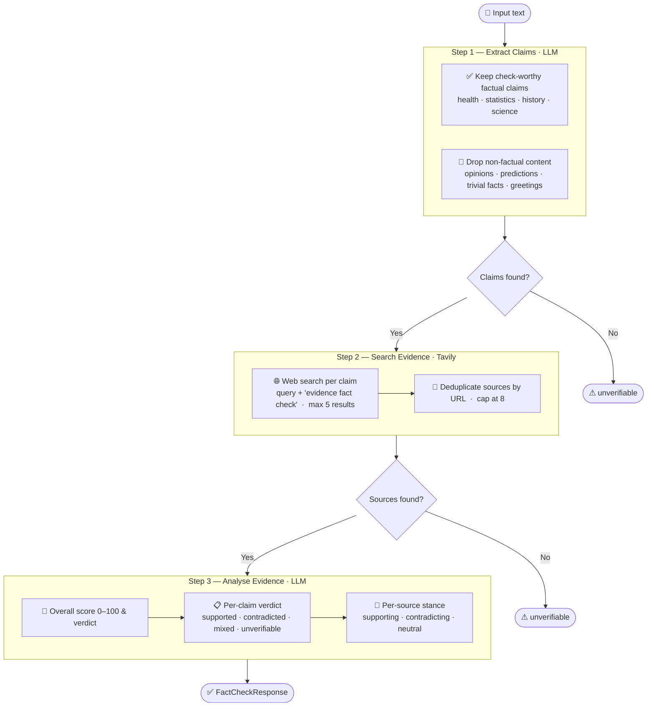
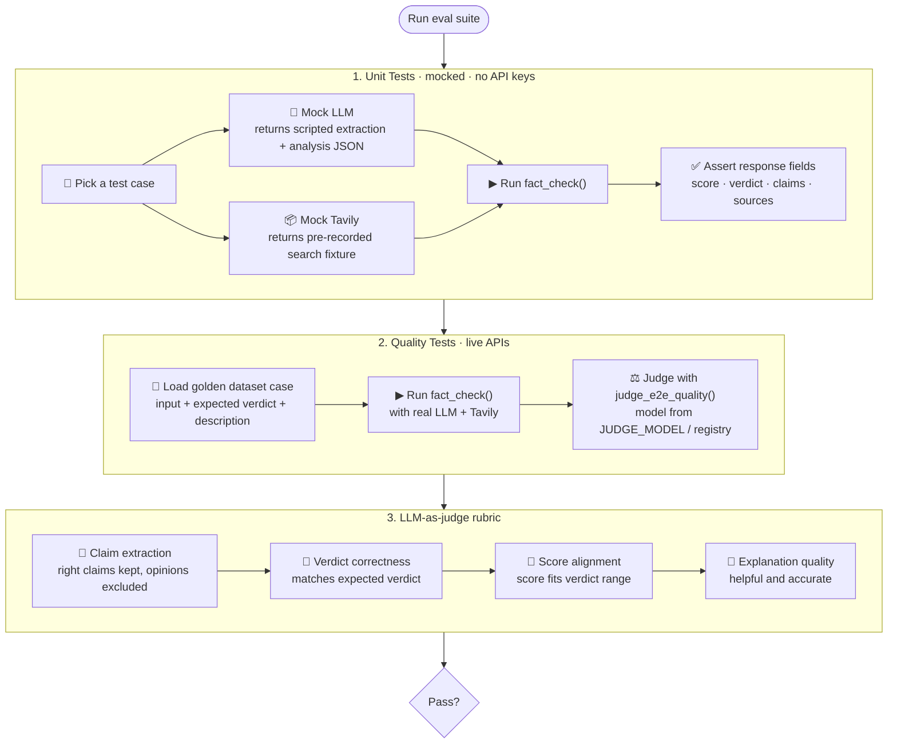

# Factify (TruthLens)

AI-powered Chrome extension for verifying factual claims on webpages.

## How it works



## Prerequisites

- Python 3.11+
- A `.env` file in the project root (copy `.env.example` and fill in your keys)

## Configuration

Copy the example env file and add your API keys:

```bash
cp .env.example .env
```

| Variable | Required | Default | Description |
|---|---|---|---|
| `OPENAI_API_KEY` | Yes | — | OpenAI key for claim extraction & analysis |
| `TAVILY_API_KEY` | Yes | — | Tavily key for web search |
| `NEBIUS_API_KEY` | Yes (evals) | — | Nebius key for eval judge model |
| `LLM_PROVIDER` | No | `openai` | `openai`, `openai_compatible`/`nebius`, `azure` (Azure OpenAI), or `azure_inference` (Azure model inference endpoint) |
| `LLM_MODEL` | No | `gpt-4o-mini` | Model ID for the pipeline, **or** a [model registry](#model-registry) alias (e.g. `kimi`, `gpt-nano`) |
| `LLM_BASE_URL` | No | `https://api.openai.com/v1` | Base URL for the LLM provider (ignored when using a registry alias that supplies its own endpoint) |
| `AZURE_OPENAI_API_KEY` | Azure only | — | Azure OpenAI API key (when `LLM_PROVIDER=azure`) |
| `AZURE_OPENAI_ENDPOINT` | Azure only | — | Azure OpenAI endpoint (when `LLM_PROVIDER=azure`) |
| `AZURE_OPENAI_API_VERSION` | Azure only | — | Azure OpenAI API version (when `LLM_PROVIDER=azure`) |
| `JUDGE_PROVIDER` | No | `openai_compatible` | `openai`, `openai_compatible`/`nebius`, `azure` (Azure OpenAI), or `azure_inference` (Azure model inference endpoint) |
| `JUDGE_MODEL` | No | `deepseek-ai/DeepSeek-V3-0324` | Judge model ID, **or** a registry alias — same options as `LLM_MODEL` |
| `JUDGE_BASE_URL` | No | `https://api.tokenfactory.nebius.com/v1/` | Base URL for the judge provider |
| `JUDGE_AZURE_OPENAI_API_KEY` | Azure only | — | Azure OpenAI API key for judge (when `JUDGE_PROVIDER=azure`) |
| `JUDGE_AZURE_OPENAI_ENDPOINT` | Azure only | — | Azure OpenAI endpoint for judge (when `JUDGE_PROVIDER=azure`) |
| `JUDGE_AZURE_OPENAI_API_VERSION` | Azure only | — | Azure OpenAI API version for judge (when `JUDGE_PROVIDER=azure`) |

All configuration is centralized in `backend/config.py` and loaded lazily from environment variables. Missing required variables raise immediately with a clear error message.

### Model registry

Secondary models are registered when their backing env vars are set (see `.env.example`). Use the alias as `LLM_MODEL` or `JUDGE_MODEL` so any model can act as the pipeline workhorse or the eval judge.

| Alias | Env vars (group) |
|-------|------------------|
| `grok-reasoning`, `grok-nonreasoning`, `kimi`, `deepseek-r` | `AZURE_BASE_URL`, `AZURE_API_KEY`, plus the corresponding `*_MODEL_NAME` |
| `deepseek-v`, `llama-maverick` | `AZURE_WEIRDOS_BASE_URL`, `AZURE_WEIRDOS_KEY`, plus model name vars |
| `gpt-nano`, `gpt-mini` | `AZURE_OPENAI_BASE_URL` (resource root or full `/openai/deployments/.../chat/completions` URL), `AZURE_OPENAI_KEY`, plus `GPT_*_MODEL_NAME` (deployment name) |

At runtime, `config.models` exposes the resolved `ModelConfig` entries for tooling and benchmarks.

## Getting Started

### 1. Install backend dependencies

```bash
python3 -m venv .venv
source .venv/bin/activate
pip install -r backend/requirements.txt
```

### 2. Start the backend

```bash
uvicorn backend.main:app --reload --port 8000
```

The API will be available at **http://localhost:8000**. Check health at `/health`.

### 3. Serve the extension mock UI

In a separate terminal:

```bash
cd extension
python3 -m http.server 3000
```

Then open **http://localhost:3000/mock.html** in your browser to interact with the mock UI.

## Running Evals

```bash
pip install -r evals/requirements.txt
python -m pytest evals/ -v
```

### Filtering benchmark runs

Benchmark cases live in `evals/test_benchmark.py` (three arms: gold evidence, searched evidence, full pipeline). Parametrised test IDs are `{dataset_name}-{sample_id}` (for example `AVeriTeC-av_001`), defined in that file.

Run a single arm:

```bash
python -m pytest evals/test_benchmark.py -m benchmark -k "TestGoldEvidenceAnalysis"
python -m pytest evals/test_benchmark.py -m benchmark -k "TestSearchedEvidenceAnalysis"
python -m pytest evals/test_benchmark.py -m benchmark -k "TestFullPipeline"
```

Run one sample (match the param ID substring; combine with the class name if needed):

```bash
python -m pytest evals/test_benchmark.py -m benchmark -k "TestGoldEvidenceAnalysis and av_001"
python -m pytest evals/test_benchmark.py -m benchmark -k "AVeriTeC-av_001"
```

Show prints and pipeline logs while debugging:

```bash
python -m pytest evals/test_benchmark.py -m benchmark -k "TestGoldEvidenceAnalysis and av_001" -s --log-cli-level=DEBUG
```

A timestamped report is still written under `evals/reports/` when any benchmark tests run in that session (see `evals/conftest.py`).

Unit tests (mocked) inject placeholder keys so they run without real credentials. Benchmark and quality (`live_api`) tests skip unless `backend.config` can load the pipeline LLM, Tavily search, and (for quality suites) the judge model from your `.env` — matching whatever providers you configure.

### How evals work


